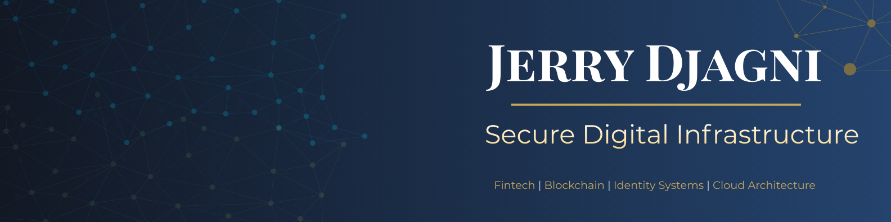

  

  

<h1 align="center">Jerry Djagni</h1>
<h3 align="center">Full-Stack Engineer • Blockchain Developer • Systems Builder</h3>

  

  
  
  

---

## 01. About Me

I build digital products and infrastructure with a strong focus on backend systems, blockchain integration, real-time applications, and scalable architecture.

My work sits at the intersection of engineering, product thinking, and systems design — from financial infrastructure and smart contract interaction to full-stack web platforms and high-functionality user systems.

I like building products that are not only functional on the surface, but properly structured underneath.

---

## 02. Current Focus

- Financial infrastructure and stablecoin systems
- Blockchain-integrated applications
- Full-stack web platforms
- Real-time Firebase systems
- Backend architecture and API design
- Product-grade user experiences

---

## 03. Core Stack

  
  
  
  
  
  
  
  
  
  
  
  
  
  
  
  

---

## 04. Featured Work

### Anchor Chain (ACC)
Cedi-focused financial infrastructure project built around digital asset systems and blockchain-backed transaction flows.

**Highlights**
- Stablecoin-oriented infrastructure thinking
- Wallet and transaction architecture
- Smart contract interaction
- Backend API design
- KYC and compliance-ready integrations
- Web and USSD-connected system ideas

### AfriCart
A full e-commerce platform built with strong attention to functionality, product management, real-time messaging, seller workflows, and platform structure.

**Highlights**
- Seller and buyer systems
- Real-time messaging
- Product filtering and detail architecture
- Wishlist, cart, and dynamic listing logic
- Firebase-powered backend workflows
- Admin and analytics direction

### QKnow Exams
A smart exam practice platform designed to help students prepare through structured practice, feedback, grading logic, and progress tracking.

**Highlights**
- Practice workflow design
- Subscription/package thinking
- Performance and progress tracking
- AI-assisted grading direction
- Product page and onboarding experience
- Strong educational platform structure

### Virtual Museum
A digital museum/web experience concept focused on structured presentation, exploration, collections, and immersive content delivery.

**Highlights**
- Information architecture
- Interactive browsing experience
- Collection-based structure
- Frontend organization
- User-centered exploration flow

---

## 05. GitHub Analytics

  
  

  

---

## 06. Contribution Graph

  

---

## 07. Engineering Mindset

I care about:
- structure
- scalability
- clean logic
- maintainability
- product flow
- technical depth
- building things that feel serious

---

## 08. Connect

  
  
  

